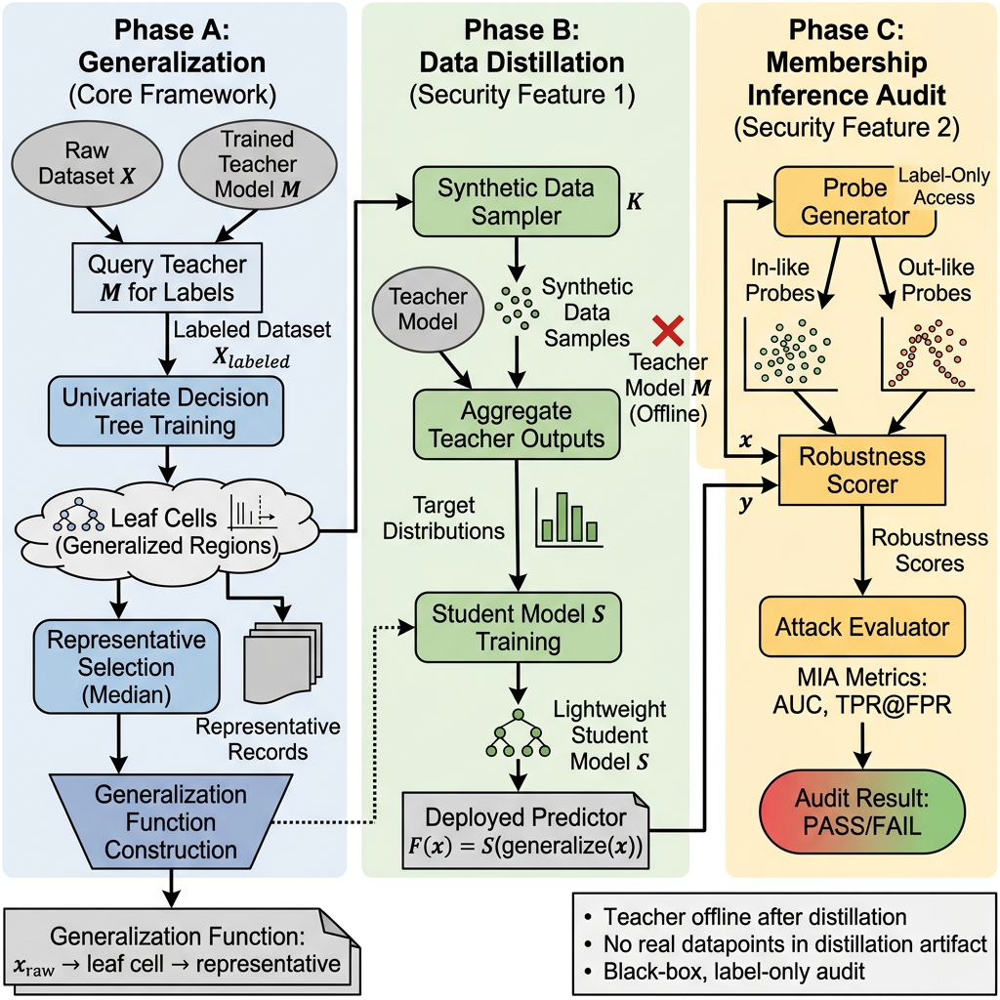

# AI-minimization-toolkit

This repository provides a univariate decision tree based dataset generalizer and two security-related extensions: data distillation and a black-box, label-only MIA audit layer.

## Components and workflow



The original framework is a univariate decision tree based dataset generalizer.


We added two key features:

- **Data Distillation:** trains a lightweight student model on synthetic, leaf-based samples so inference can run without the teacher, following the teacher–student knowledge distillation paradigm introduced by Hinton et al. (2015).
- **MIA audit layer (label-only)**: probes the deployed pipeline to estimate membership inference risk under a black-box, label-only threat model, following the robustness-based attacks described by Choquette-Choo et al. (2021).

The pipeline has three phases: generalization, distillation, and audit. Each phase is optional, but they are designed to compose in the following sequence.

### Phase A — Generalization (core framework)

1. Train any scikit-learn estimator (the teacher) on original data.
2. Create `GeneralizeToRepresentative` with the teacher and a target accuracy.
3. Call `fit(X, y_pred)` where `y_pred` are the teacher's predictions on `X`.
4. Internally, a univariate decision tree is trained on `X` with labels `y_pred`.
5. Each tree leaf becomes a **cell** with per-feature numeric ranges.
6. Each cell is assigned a **representative record** (closest to the median),
   which is used to replace original values during `transform`.
7. The generalizer can relax or tighten generalization to meet the target accuracy, and computes an information-loss score (NCP).

At this point, you can already do inference as:

`teacher( generalize(x) )`

### Phase B — Data distillation 

8. Extract leaf regions from the generalizer (feature ranges + support).
9. For each leaf, sample `K` synthetic points inside the region.
10. Query the teacher on those points to obtain probabilities per class.
11. Aggregate into a leaf target distribution `p_leaf` (mean of probabilities).
12. Train a **student** model to map the leaf representative to `p_leaf`.
13. Persist the student so inference no longer depends on the teacher.

After distillation, inference becomes:

`student( generalize(x) )`

### Phase C — MIA audit 

14. Generate **in-like probes** from inside leaf regions.
15. Generate **out-like probes** near region boundaries or broader ranges.
16. Query the deployed pipeline using label-only responses.
17. Compute robustness scores (`flip_rate` or `min_delta`).
18. Evaluate attack metrics (AUC, best accuracy, TPR@FPR=1%).
19. Report PASS/FAIL without changing the model (audit is decoupled).


## Key Privacy/Security Intuition

The generalization and distillation components jointly reduce the exposure of sensitive information by eliminating fine-grained dependencies on individual data records. Generalization collapses the input space into coarse, region-based representations, which limits the precision of observable inputs. Data distillation further strengthens this protection by training a lightweight student model on aggregated teacher outputs derived from synthetic samples, ensuring that the deployed predictor no longer depends directly on the original model or any individual training datapoint.

To complement these structural protections, we introduce a black-box, label-only membership inference audit layer that empirically evaluates residual privacy leakage. By probing the deployed pipeline with synthetic inputs and measuring robustness-based signals under a label-only threat model, the audit quantifies the extent to which
membership information may still be inferred. This decoupled audit mechanism provides a practical and reproducible safety assessment without requiring access to training data or internal model states.

## Framework structure

### Core modules

- `minimization/minimizer.py`

  - **Class**: `GeneralizeToRepresentative`
  - **Key methods**:
    - `fit(X, y)`: trains a decision tree on model predictions, derives leaf cells,
      selects representatives, and adjusts generalization to meet target accuracy.
    - `transform(X)`: maps records to leaf representatives.
    - `get_leaf_regions(...)`: extracts per-leaf numeric ranges (and categorical sets).
    - `distill_teacher(...)`: runs the distillation workflow and returns a student.
- `minimization/distillation.py`

  - **Data structure**: `Region` (leaf constraints + support).
  - **Key functions**:
    - `extract_leaf_regions(...)`: builds leaf region constraints and support counts.
    - `sample_region(...)`: samples synthetic data inside a region.
    - `build_leaf_dataset(...)`: queries teacher on synthetic data and aggregates
      per-leaf distributions.
    - `train_student(...)`: trains a student (`logreg` or `mlp`).
    - `predict_with_student(...)`: inference swap `student(generalize(x))`.
- `minimization/audit.py`

  - **Key functions**:
    - `generate_probes(...)`: in-like / out-like probe generation.
    - `score_flip_rate(...)`, `score_min_delta(...)`: robustness scores.
    - `evaluate_attack(...)`: AUC, best-threshold accuracy, TPR@FPR=1%.
  - **Class**: `DeployedPredictor` for label-only queries.

### Examples and scripts

- `examples/experiment_generalize.py`: generalization only.
- `examples/experiment_distill.py`: distillation only.
- `examples/experiment_audit.py`: audit only.
- `examples/experiment_pipeline_breast_cancer.py`: full pipeline (generalize → distill → audit).
- `examples/experiment_pipeline_iris.py`: full pipeline (generalize → distill → audit).

### Functional dependencies / sequence

1. `GeneralizeToRepresentative.fit()` → `get_leaf_regions()`
2. Distillation:
   `build_leaf_dataset()` → `train_student()` → `predict_with_student()`
3. Audit:
   `generate_probes()` → `score_*()` → `evaluate_attack()`

## Tutorial

### Common arguments (pipeline scripts)

- `--samples_per_leaf`: synthetic samples per leaf.
- `--student_type {logreg, mlp}`: student model type.
- `--min_leaf_support`: minimum leaf support to include in distillation/audit.
- `--temperature`: temperature for probability smoothing.
- `--n_in`, `--n_out`: number of in-like / out-like probes for audit.
- `--perturb_rounds`: number of perturbations per probe for flip-rate.
- `--noise_schedule`: comma-separated noise scales (e.g., `0.01,0.02,0.05,0.1`).
- `--score {flip_rate, min_delta}`: robustness score type.
- `--pass_auc`, `--pass_tpr_at_fpr`: audit thresholds.
- `--seed`: random seed.

### End-to-end pipeline examples

Before running the examples, make sure your python >= 3.6, and install dependencies:

```bash
pip install -r requirements.txt
pip install -e .
```

**Breast cancer dataset**:

```bash
python examples/experiment_pipeline_breast_cancer.py --samples_per_leaf 100 --student_type logreg \
  --min_leaf_support 2 --temperature 1.5 --n_in 200 --n_out 200 --score flip_rate --seed 42
```

**Iris dataset**:

```bash
python examples/experiment_pipeline_iris.py --samples_per_leaf 100 --student_type logreg \
  --min_leaf_support 1 --temperature 1.0 --n_in 200 --n_out 200 --score flip_rate --seed 42
```

## Notes

- Numeric features only. Categorical features must be encoded before using the transformer.
- The package name is `ai-minimization-toolkit` and the current version here is `0.0.1`.

## References

[1] Geoffrey Hinton, Oriol Vinyals, and Jeff Dean. 
Distilling the Knowledge in a Neural Network.
NeurIPS Deep Learning Workshop, 2015.

[2] Christopher A. Choquette-Choo, Florian Tramer, Nicholas Carlini, and Nicolas Papernot. 
Label-Only Membership Inference Attacks. 
Proceedings of the 38th International Conference on Machine Learning (ICML), 2021.
